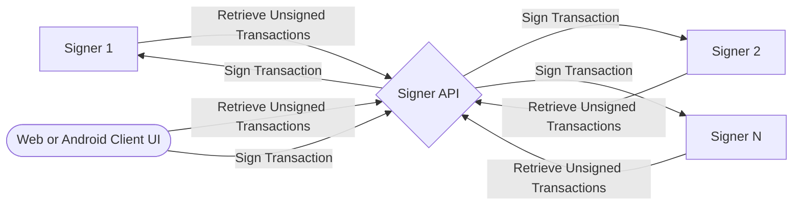
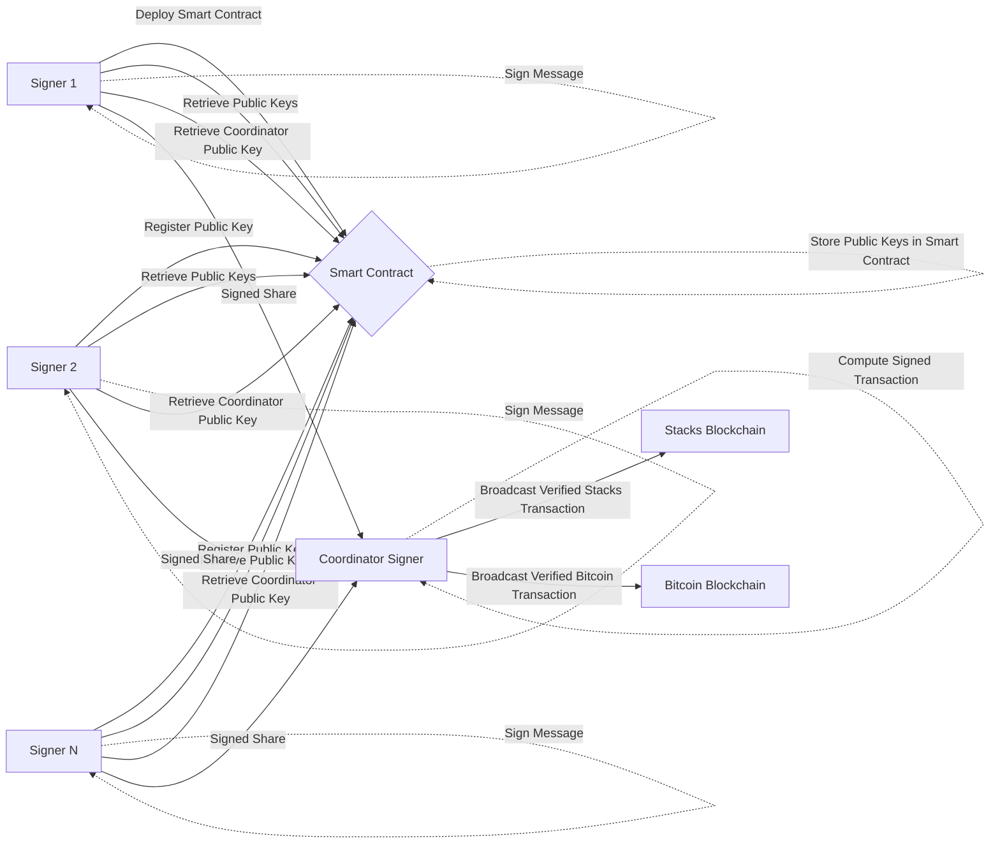

The following Data Flow Diagrams (DFD) illustrate the communication process between DKG signers (Signer 1, Signer 2, ..., Signer N), client UIs, and the Smart Contract in the Stacks blockchain. The first DFD shows the interaction of the signers with the client UIs and the corresponding API to retrieve and sign transactions. The second DFD shows the flow of data between the signers, the smart contract, and the blockchain for key registration, public key retrieval, shared public key computation, message signing, and signature verification.

1. Interaction of the signers with the Client UIs and the API:

2. Interaction between the signers and the smart contract:

